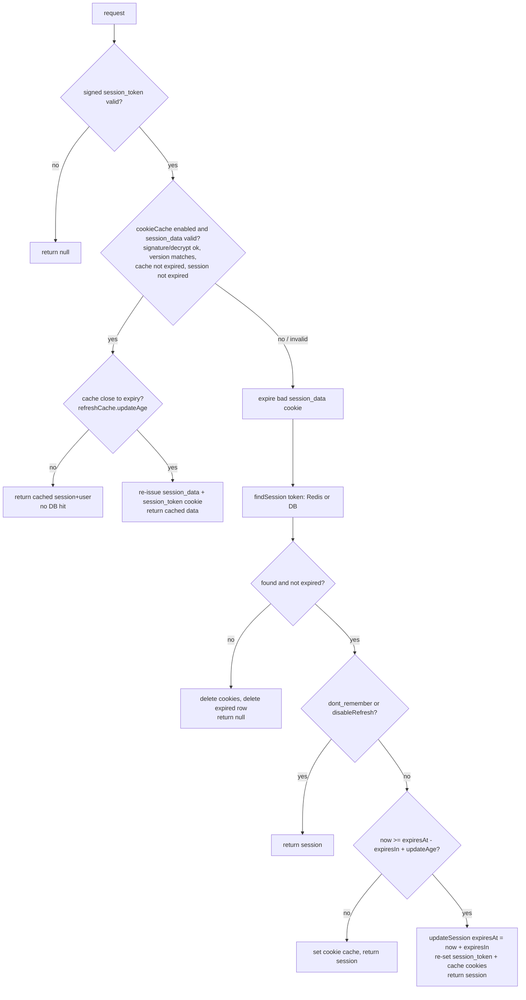

# 1 – How better-auth sessions & cookies work

Sources: `better-auth/packages/better-auth/src/cookies/index.ts`,
`cookies/session-store.ts`, `api/routes/session.ts`, `db/internal-adapter.ts`.

## 1.1 The core idea

better-auth uses **server-side sessions identified by an opaque random token**.
The token goes into an **HMAC-signed, HttpOnly cookie**. Each request turns the
token back into a session by looking it up in the **database** or **secondary
storage** (Redis, …). JWTs are optional: you add them with the `jwt` plugin, or use
one of them as a short-lived *cache* of the session (cookie cache).

```
Browser ──cookie: better-auth.session_token=<token>.<hmac>──▶ server
                                                            │ verify HMAC
                                                            │ look up token (cache cookie → Redis → DB)
                                                            ▼
                                                   { session, user }
```

## 1.2 The session record

Created by `internalAdapter.createSession(userId, dontRememberMe, override)`:

| Field | Value |
|---|---|
| `id` | `generateId()` (or the DB adapter's id) |
| `token` | `generateId(32)` → 32 random `[a-zA-Z0-9]` chars, **stored as-is** |
| `userId` | owner |
| `expiresAt` | `now + session.expiresIn` (default **7 days**), or `now + 1 day` when rememberMe=false |
| `ipAddress` | from the configured IP headers (`advanced.ipAddress`) |
| `userAgent` | `User-Agent` header |
| `createdAt/updatedAt` | now |
| + additional fields | `session.additionalFields`, plugin fields (`activeOrganizationId`, `impersonatedBy`, …) |

Database hooks (`databaseHooks.session.create.before/after`) run around the insert.
A user can have **any number of sessions** (one per device/browser).

## 1.3 Where sessions are stored

| Configuration | Write | Read |
|---|---|---|
| DB only (default) | `session` table | `session` table (+ join `user`) |
| `secondaryStorage` set | Redis: key `<token>` → `{"session":…, "user":…}` with TTL = time to expiry; key `active-sessions-<userId>` → `[{token, expiresAt}]` (sorted, expired entries pruned) | Redis |
| `secondaryStorage` + `session.storeSessionInDatabase: true` | Redis **and** DB | Redis |
| `+ session.preserveSessionInDatabase: true` | DB rows kept after revocation (audit) | Redis |
| no DB, no secondary storage (stateless) | only the cookie cache (JWE, maxAge = expiresIn) | cookie |

## 1.4 Cookies

Created by `createCookieGetter(options)`. Default prefix `better-auth`. Default attributes:
`HttpOnly; SameSite=Lax; Path=/`. `Secure` is set, and names get a `__Secure-` prefix, when:
`advanced.useSecureCookies` is set → else baseURL is `https://` → else `NODE_ENV=production`.
`advanced.crossSubDomainCookies` adds `Domain=`. `advanced.cookies[name]` and
`advanced.defaultCookieAttributes` override per cookie or globally.

| Cookie | Content | Max-Age |
|---|---|---|
| `better-auth.session_token` | `token.base64(HMAC-SHA256(secret, token))` (signed cookie, URL-encoded) | `expiresIn` (7 d); **no Max-Age** (browser-session cookie) when rememberMe=false |
| `better-auth.session_data` | cookie cache (see 1.6); split into `session_data.0 … .n` chunks above ~4 KB | `cookieCache.maxAge` (5 min) |
| `better-auth.dont_remember` | signed `"true"` | browser session |
| `better-auth.account_data` | OAuth account cache (`account.storeAccountCookie`) | cookieCache.maxAge |
| `better-auth.oauth_state` | OAuth state when `storeStateStrategy: "cookie"` | short |
| plugin cookies | `admin_session` (impersonation), `two_factor`, `trust_device`, `session_token_multi-*`, `last_used_login_method` | varies |

The token is signed, so a forged or tampered cookie fails before any DB lookup.
Revoking a session still needs the server-side lookup.

Sign-out (`deleteSessionCookie`) expires every auth cookie, including the cache chunks,
`account_data` and `oauth_state`. It also scrubs any `Set-Cookie` for those names already
queued on the same response, so a valid cookie never leaks (this matters for the 2FA after-hook).

## 1.5 Reading a session – `GET /get-session`



Details:
- Responses carry `Cache-Control: no-store`.
- **Sliding expiration**: by default the DB is written **at most once per `updateAge`
  (1 day)**, not on every request.
- `deferSessionRefresh: true`: GET never writes. It returns `needsRefresh: true` and the
  client calls `POST /get-session` to do the write (useful with read replicas). Without this
  option, `POST /get-session` is rejected (`METHOD_NOT_ALLOWED_DEFER_SESSION_REQUIRED`).
- Query flags: `disableCookieCache=true` forces an authoritative lookup; `disableRefresh=true`
  skips the sliding update.

## 1.6 Cookie cache (`session.cookieCache`)

A **signed or encrypted snapshot of `{session, user, updatedAt, version}`**. When it is
valid, the server skips the DB/Redis lookup for up to `maxAge`.

| Strategy | Format | Confidentiality |
|---|---|---|
| `compact` (default) | `base64url(JSON{session:{session,user,updatedAt,version}, expiresAt, signature})`, signature = HMAC-SHA256 base64url-nopad over `JSON{...session, expiresAt}` | readable by anyone holding the cookie |
| `jwt` | HS256 JWT signed with secret, `exp` = maxAge | readable |
| `jwe` | `dir` + A256CBC-HS512, key derived (HKDF) from secret, salt `"better-auth-session"` | encrypted |

- `version` (string or `fn(session,user)`) lets you invalidate every cached cookie at once,
  for example after a role-model change.
- `refreshCache: { updateAge }` (default 20 % of maxAge): re-issue the cache shortly before it expires.
- Trade-off: a revoked session can stay valid **for up to `maxAge` (5 min)** on endpoints that
  accept the cache. Sensitive endpoints use `sensitiveSessionMiddleware`, which **bypasses
  the cache** whenever a server-side store exists.

## 1.7 Endpoint guards (middlewares)

| Middleware | Behaviour |
|---|---|
| `sessionMiddleware` | requires a session (cache allowed) → 401 `UNAUTHORIZED` |
| `sensitiveSessionMiddleware` | requires an **authoritative** session (cache bypassed if stateful) – used for password/email changes, deletions |
| `freshSessionMiddleware` | session must be younger than `freshAge` (1 d) from `createdAt` → 403 `SESSION_NOT_FRESH` (e.g. `list-sessions`, `delete-user`) |
| `requestOnlySessionMiddleware` | session required for HTTP calls, optional for server-side `auth.api.*` calls |

## 1.8 Session management endpoints

`list-sessions` (fresh session required), `revoke-session {token}`, `revoke-sessions` (all),
`revoke-other-sessions`, `update-session` (additional fields), `sign-out`.
Revocation deletes the row/Redis key, so it takes effect **on the next request** (except
inside the cookie-cache window, see 1.6).

## 1.9 Extra transports (plugins)

| Plugin | What it adds |
|---|---|
| `bearer` | Accepts `Authorization: Bearer <token or signed token>` (mobile, CLIs); returns the token in the `set-auth-token` header |
| `jwt` | `GET /token` → short-lived (15 min) asymmetric JWT (EdDSA default), `GET /jwks`, `set-auth-jwt` header; for verification by other services without DB access |
| `multi-session` | several signed `session_token_multi-*` cookies per browser, switch active account |
| `custom-session` | reshape the `get-session` response |
| `@better-auth/expo` | stores cookies in SecureStore and sends them as a header from React Native |

## 1.10 Security properties

- Tokens: 32 chars from 62 symbols ≈ 190 bits of entropy; HMAC signature blocks tampering.
- HttpOnly + SameSite=Lax + origin check + fetch-metadata CSRF checks on state-changing requests.
- **Revocation is immediate** (server-side lookup), bounded only by the optional cookie cache.
- Role/ban/user changes are seen on the next lookup (or after at most `maxAge` with the cache).
- Weak point: the session `token` is stored **in plaintext** in the DB/Redis, so a DB read leak
  lets someone hijack sessions until they expire.
