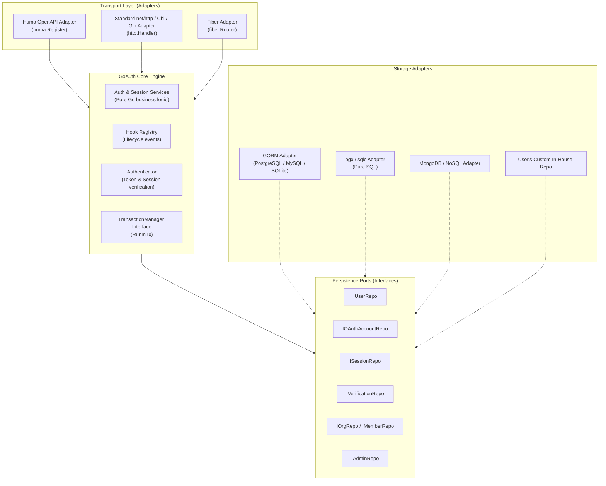

# Architectural Blueprint: Database-Agnostic & Adapter-Agnostic GoAuth

## Executive Summary

Making **Better-Go-Auth** database-independent and HTTP router/adapter-agnostic is **one of the best architectural decisions you can make for the library**.

In the Go ecosystem, authentication libraries frequently struggle to gain widespread adoption because they bind themselves tightly to a specific ORM (like GORM) or a specific router (like Huma, Gin, or Fiber). Go developers have strong preferences:
- **Database**: Many teams avoid GORM in favor of `pgx`, `sqlc`, `ent`, `bun`, or raw SQL, while others require NoSQL/Document stores like MongoDB or DynamoDB.
- **HTTP Routing**: While Huma is fantastic for OpenAPI 3.1 and typed schemas, many Go web apps are built on `net/http`, `chi`, `gin`, `fiber`, or `echo`.

By decoupling the core from GORM and Huma, `goauth` mirrors the universal success of modern auth frameworks (like TypeScript's **Better Auth** and **Lucia Auth**), expanding your addressable audience from a narrow niche to the entire Go ecosystem.

---

## 1. Architectural Vision: Hexagonal (Ports & Adapters)



---

## 2. Part I: Database Independence (Repository Pattern)

### 2.1 The Current Bottlenecks
Currently, several parts of the system are hard-wired to GORM:
1. `GoAuthOptions` requires `Conn *gorm.DB`.
2. `core_migration.NewGORMAdminMigrator(opts.Conn)` is hardcoded in `SetupGoAuth`.
3. `authenticator.NewDefaultAuthenticator` accepts `db *gorm.DB` for session/user lookups.
4. `providers.NewRevocationStore` and `providers.NewProvider` require `*gorm.DB`.
5. Plugins default to GORM repositories instantiated directly with `*gorm.DB`.

### 2.2 Core Repository Interfaces
The repository interfaces in `src/app/repository/repo_interfaces` are already clean and pure Go! We only need to formalize the full suite of repositories needed by core:

```go
// src/app/repository/repo_interfaces/auth_repos.go

type Repositories struct {
    User         IUserRepo
    Account      IOAuthAccountRepo
    Session      ISessionRepo
    Verification IVerificationRepo
}
```

#### Session Repository (`ISessionRepo`)
Extract session queries away from `*gorm.DB`:
```go
type ISessionRepo interface {
    CreateSession(ctx context.Context, session *models.Session) (*models.Session, error)
    GetSessionByToken(ctx context.Context, token string) (*models.Session, error)
    GetSessionByID(ctx context.Context, sessionID string) (*models.Session, error)
    UpdateSession(ctx context.Context, sessionID string, data map[string]any) (*models.Session, error)
    DeleteSession(ctx context.Context, sessionID string) error
    DeleteSessionsByUserID(ctx context.Context, userID string) error
    ListSessionsByUserID(ctx context.Context, userID string) ([]models.Session, error)
}
```

### 2.3 Database-Agnostic Authenticator
In `src/providers/authenticator/authenticator.go`, change `NewDefaultAuthenticator` to take repository interfaces instead of `*gorm.DB`:

```go
// BEFORE (coupled to GORM):
func NewDefaultAuthenticator(accessSecret string, db *gorm.DB) AuthenticateFunc

// AFTER (database agnostic):
type SessionLookupRepo interface {
    GetSessionByToken(ctx context.Context, token string) (*models.Session, error)
    GetUserByID(ctx context.Context, userID string) (*models.User, error)
}

func NewDefaultAuthenticator(accessSecret string, lookup SessionLookupRepo) AuthenticateFunc {
    // Looks up session and user via the interface, without knowing the database engine!
}
```

### 2.4 DB-Agnostic Transaction Management
A transaction manager should not expose `*gorm.DB`. Instead, use context-scoped transactions:

```go
// src/common/interfaces/transaction.go
type TransactionManager interface {
    RunInTx(ctx context.Context, fn func(txCtx context.Context) error) error
}
```

- **For GORM**: `txCtx` holds the `*gorm.DB` transaction instance:
  ```go
  func (m *GormTxManager) RunInTx(ctx context.Context, fn func(txCtx context.Context) error) error {
      return m.db.WithContext(ctx).Transaction(func(tx *gorm.DB) error {
          return fn(context.WithValue(ctx, txKey{}, tx))
      })
  }
  ```
- **For pgx/sql**: `txCtx` holds `pgx.Tx` or `*sql.Tx`.
- **For MongoDB**: `txCtx` holds `mongo.SessionContext`.
- **For databases without multi-doc transactions** (or in-memory): `RunInTx` simply executes `fn(ctx)`.

Repositories extract their driver-specific tx from `ctx` if present; otherwise, they use their default connection.

### 2.5 DB-Agnostic Migrations
Your existing [`IMigrator`](file:///home/k/Documents/7proj/better-go-auth/goauth/src/models/migration/migration.go) interface is already well-designed:

```go
type IMigrator interface {
    Migrate(ctx context.Context) error
}
```

To support different storage backends:
1. **GORM Migrator**: Runs `db.AutoMigrate(...)`.
2. **SQL Migrator**: Runs embedded `.sql` scripts (using `golang-migrate`, `goose`, or plain `db.Exec`).
3. **No-Op Migrator**: For users whose migrations are handled externally (e.g. Atlas, Prisma, Flyway, or manual DBAs):
   ```go
   type NoOpMigrator struct{}
   func (NoOpMigrator) Migrate(ctx context.Context) error { return nil }
   ```

---

## 3. Part II: Router & Adapter Independence (HTTP Layer)

### 3.1 The Current Bottleneck
`SetupGoAuth` currently takes `api huma.API`:
```go
func SetupGoAuth(api huma.API, opts GoAuthOptions) (*GoAuth, error)
```
And registers routes directly on Huma. If a developer uses Chi, Gin, Fiber, or Echo without Huma, they cannot use `goauth`.

### 3.2 The Solution: Two-Tier Architecture

#### Tier 1: The Core Engine (`goauth.Engine`)
The core engine has **zero HTTP routing dependencies**. It initializes services, repositories, lifecycle hooks, and options:

```go
package goauth

type Engine struct {
    Options            Options
    AuthServices       serv_interfaces.IAuthServices
    Repositories       repo_interfaces.Repositories
    Hooks              plugin.HookRegistry
    Plugins            map[string]plugin.Plugin
    TransactionManager interfaces.TransactionManager
    Authenticator      authenticator.AuthenticateFunc
}

func New(opts Options) (*Engine, error) {
    // 1. Validate options
    // 2. Run migrations (if migrator is supplied)
    // 3. Initialize core services (auth, session, email)
    // 4. Initialize hook registry
    // 5. Initialize plugins with InitContext (passing repositories, hooks, txManager)
    return engine, nil
}
```

#### Tier 2: Transport Adapters
Each router ecosystem gets its own adapter package:

1. **Huma Adapter (`adapters/huma`)**:
   ```go
   import "github.com/better-go-auth/goauth/adapters/humaadapter"

   engine, _ := goauth.New(opts)
   humaadapter.Register(api, engine)
   ```
   Maintains all existing OpenAPI 3.1 features, request validation, and schema definitions.

2. **Standard HTTP Adapter (`adapters/http`)**:
   Returns standard `http.Handler` or mounts onto any `net/http` multiplexer (Chi, Gorilla, Go 1.22+ `http.ServeMux`):
   ```go
   import "github.com/better-go-auth/goauth/adapters/httpadapter"

   engine, _ := goauth.New(opts)
   router.Mount("/api/auth", httpadapter.NewHandler(engine))
   ```

3. **Gin / Fiber Adapters**:
   Can wrap the standard `http.Handler` or use native framework handlers:
   ```go
   // Fiber:
   app.Use("/api/auth", adaptor.HTTPHandler(httpadapter.NewHandler(engine)))
   ```

---

## 4. Part III: Plugin Evolution for DB & Adapter Independence

### 4.1 Plugin Repository Pattern
Plugins follow the same repository inversion as Core:

```go
// plugins/org/repository/interfaces.go
type OrgRepositories struct {
    OrgRepo        IOrgRepo
    MemberRepo     IMemberRepo
    InvitationRepo IInvitationRepo
    Migrator       migration.IMigrator
}
```

A user can instantiate the plugin with:
- First-party GORM repositories:
  ```go
  orgPlugin := org.NewWithGorm(db, org.Config{...})
  ```
- Or completely custom repositories:
  ```go
  orgPlugin := org.NewWithRepos(myCustomOrgRepos, org.Config{...})
  ```

### 4.2 Updated `InitContext`
`InitContext` should not contain `*gorm.DB` or `huma.API` directly. Instead, it provides core services and metadata:

```go
type InitContext struct {
    Ctx           context.Context
    Config        config.AuthConfig
    TxManager     interfaces.TransactionManager
    IAuthServices serv_interfaces.IAuthServices
    IAuthRepos    repo_interfaces.IAuthRepos
    Authenticate  authenticator.AuthenticateFunc
    Hooks         HookRegistry
    Extras        map[string]any
}
```

### 4.3 Plugin Route Registration Across Adapters
Plugins can implement adapter-specific interfaces depending on the target framework:

```go
// For Huma users:
type HumaRouteRegistrar interface {
    RegisterHuma(api huma.API, authMiddleware *middleware.AuthMiddleware)
}

// For Standard net/http users:
type HTTPRouteRegistrar interface {
    RegisterHTTP(mux *http.ServeMux, authMiddleware func(http.Handler) http.Handler)
}
```

When `humaadapter.Register(api, engine)` runs, it checks:
```go
for _, p := range engine.Plugins {
    if hr, ok := p.(HumaRouteRegistrar); ok {
        hr.RegisterHuma(api, mdlWare)
    }
}
```
When `httpadapter.Register(mux, engine)` runs, it checks for `HTTPRouteRegistrar`.

---

## 5. Proposed Project Layout

To cleanly organize core, plugins, and adapters:

```
better-go-auth/goauth/
├── goauth.go                         # Core Engine (New, Options, Setup)
├── src/
│   ├── app/
│   │   ├── core/                     # Pure business logic (Auth, Session, Email)
│   │   ├── repository/
│   │   │   └── repo_interfaces/      # DB-agnostic interfaces (IUserRepo, ISessionRepo, etc.)
│   │   └── services/                 # Domain service interfaces
│   ├── models/                       # Core domain entities (User, Session, Account)
│   ├── plugins/                      # Plugin contracts, HookService, HookRegistry
│   │   ├── admin/                    # Admin plugin (services, interfaces, DTOs)
│   │   └── org/                      # Org plugin (services, interfaces, DTOs)
│   └── common/                       # Shared errors, consts, utils
├── adapters/                         # Adapters layer (Drivers & Transports)
│   ├── db/
│   │   └── gorm/                     # Official GORM implementation of all repositories
│   └── http/
│       ├── huma/                     # Huma OpenAPI 3.1 route registrations
│       └── standard/                 # Standard net/http / Chi route registrations
```

---

## 6. Actionable Step-by-Step Roadmap

### Phase 1: Database Decoupling (Core & Authenticator)
- [ ] **Step 1**: Add `ISessionRepo` and `IVerificationRepo` to `repo_interfaces`.
- [ ] **Step 2**: Refactor `authenticator.NewDefaultAuthenticator` to take `SessionLookupRepo` instead of `*gorm.DB`.
- [ ] **Step 3**: Update `GoAuthOptions` to accept `repo_interfaces.Repositories` and `migration.IMigrator`.
- [ ] **Step 4**: Provide a convenience constructor `goauth.WithGORM(db *gorm.DB)` that wires all GORM repositories, GORM transaction manager, and GORM migrator automatically for GORM users.

### Phase 2: Transaction Manager Decoupling
- [ ] **Step 1**: Ensure all repositories extract `tx` from `ctx` using context keys rather than depending on a global `*gorm.DB`.
- [ ] **Step 2**: Keep `TransactionManager` interface driver-agnostic (`RunInTx(ctx, fn)`).

### Phase 3: Router Decoupling (Separating Engine from Huma)
- [ ] **Step 1**: Split `SetupGoAuth` into:
  - `goauth.New(opts)` $\rightarrow$ returns `*Engine` (pure logic, no HTTP).
  - `humaadapter.Register(api, engine)` $\rightarrow$ registers Huma routes and operations.
- [ ] **Step 2**: Keep `SetupGoAuth(api, opts)` as a backward-compatible wrapper that simply runs `New(opts)` followed by `humaadapter.Register(api, engine)`.
- [ ] **Step 3**: Build `httpadapter.Register(mux, engine)` to provide standard `net/http` endpoints.

### Phase 4: Plugin Decoupling
- [ ] **Step 1**: Remove `Api huma.API` and `DB *gorm.DB` from `InitContext`.
- [ ] **Step 2**: Provide `RegisterHuma` and `RegisterHTTP` on plugins via optional interfaces (`HumaRouteRegistrar`, `HTTPRouteRegistrar`).

---

## 7. Conclusion & Recommendation

| Approach | Developer Reach | Ecosystem Compatibility | Implementation Effort |
|---|---|---|---|
| **Current (GORM + Huma only)** | Low (~10% of Go devs) | Locked to GORM & Huma | None (already built) |
| **Proposed (Agnostic Core + First-party Adapters)** | **Universal (100% of Go devs)** | Any SQL/NoSQL DB, Any Router (Huma, Chi, Gin, Fiber) | Moderate, non-breaking refactoring |

By keeping **GORM** and **Huma** as **first-class, officially supported adapters**, existing users lose nothing and keep full OpenAPI support. Meanwhile, developers using `pgx`, `sqlc`, `ent`, `MongoDB`, `Chi`, or `Gin` can easily plug into `goauth`.
